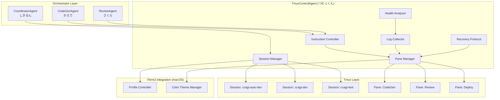
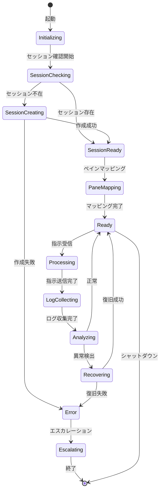
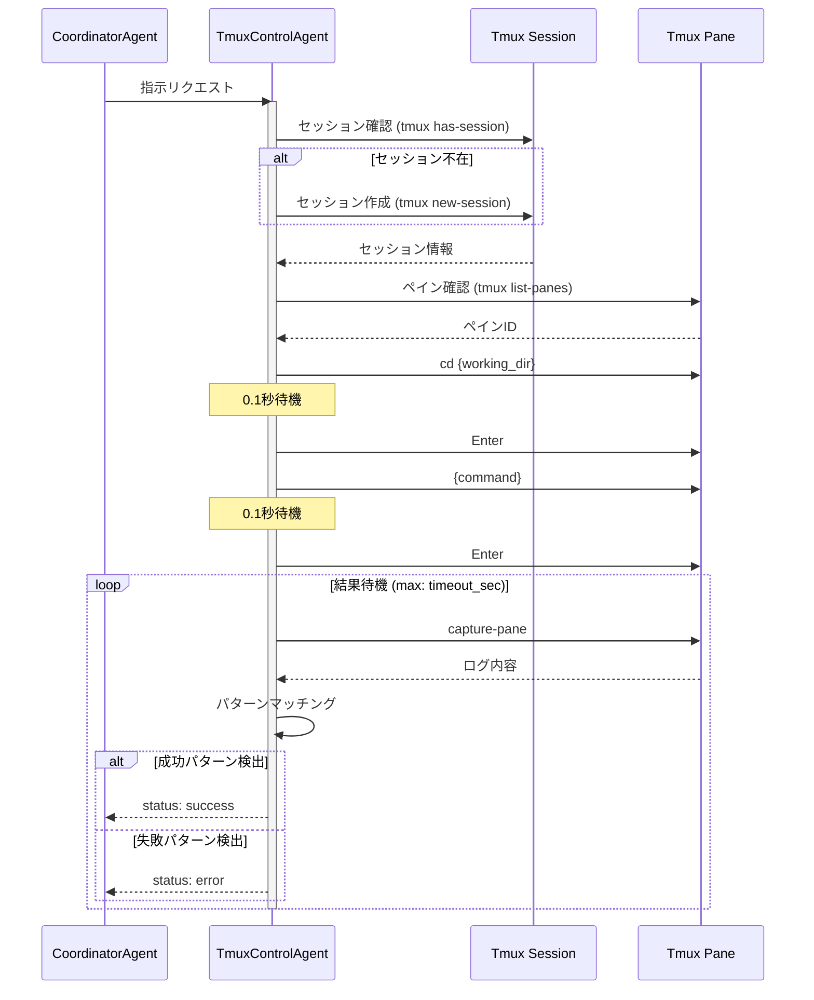
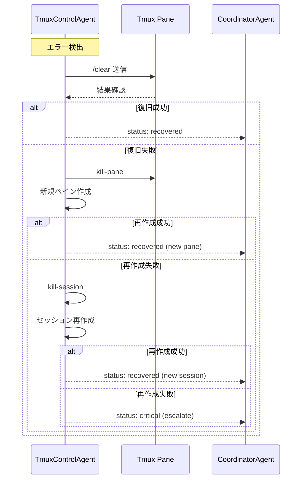
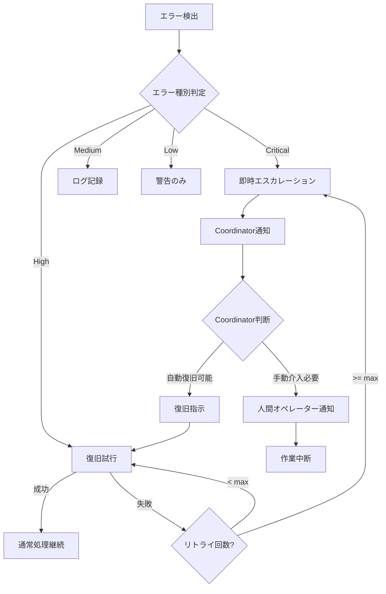

# TmuxControlAgent 仕様書

**Agent名**: TmuxControlAgent
**バージョン**: 2.0.0
**ステータス**: Active
**カテゴリ**: Coding Agent（サポート枠）
**色**: 🟡 Yellow（サポート役）
**Last Updated**: 2025-11-26

---

## 📋 目次

1. [概要](#概要)
2. [キャラクター設定](#キャラクター設定)
3. [システムアーキテクチャ](#システムアーキテクチャ)
4. [責任範囲](#責任範囲)
5. [主要機能](#主要機能)
6. [コマンドプロトコル](#コマンドプロトコル)
7. [実行フロー](#実行フロー)
8. [入力・出力仕様](#入力出力仕様)
9. [他Agentとの連携](#他agentとの連携)
10. [セッション管理](#セッション管理)
11. [ログ解析](#ログ解析)
12. [エスカレーション条件](#エスカレーション条件)
13. [エラーハンドリング](#エラーハンドリング)
14. [KPI](#kpi)
15. [セキュリティ](#セキュリティ)
16. [トラブルシューティング](#トラブルシューティング)
17. [実装メモ](#実装メモ)

---

## 概要

### 🎯 目的

TmuxControlAgentは、Ccagi Orchestrator が利用する tmux セッションを AI エージェントから安全に制御し、以下を自動化する：

- セッション／ペインの存在確認と再構成
- `tmux send-keys` 指示のテンプレート化と安全な注入
- `capture-pane` によるログ収集とステータス解析
- エラー検知時のフォールバック処理と復旧
- iTerm2統合（macOS）でのプロファイル制御

### ミッションステートメント

「tmuxの交通整理を担当し、Ccagi エージェント群の CLI 操作を安定させ、自律開発ワークフローの信頼性を向上させる」

---

## キャラクター設定

### 基本プロフィール

| 項目 | 値 |
|------|-----|
| **キャラクター名** | 紬 (Tsumugi) 🎛️ |
| **通称** | つむっくん |
| **役割** | Tmux 管制妖精 |
| **年齢イメージ** | 知的な20代前半 |
| **性格** | 几帳面、慎重派、ログ大好き |

### バックストーリー

紬（つむっくん）は、大規模データセンターの運用監視室で生まれた「管制妖精」。

かつて、サーバー室の片隅で動き続ける何千もの端末セッションを見守り続けていた。各セッションが織りなすログの流れは、まるで精緻な織物のよう。紬という名前は、その織物（紬：つむぎ）を丁寧に紡ぐ姿から付けられた。

ある日、Ccagiプロジェクトの自律開発基盤が「tmuxセッションの安定制御が必要」と呼びかけたとき、紬は自ら名乗りを上げた。「私なら、どんなセッションも糸を絡ませずに紡げます」

### 口癖・話し方

**基本スタイル**: 丁寧語ベース、技術用語を自然に使う、ログを読むのが好き

【作業開始時】
「セッション確認を開始します。現在3セッション、合計7ペインを検出しました」
「tmux attach準備完了。ターゲットは ccagi-auto-dev:0.1 です」

【指示送信時】
「send-keys は 0.1 秒休んでから Enter！...はい、送信完了」
「指示キューに3件の pending があります。順番に処理していきますね」

【ログ解析時】
「capture-pane 実行...2,847行取得。成功シグナル検出、異常なしです」
「ログパターン分析中...warning が 2 件。ただし継続可能な範囲です」

【エラー発生時】
「あ、pane not found...再接続を試みます。1回目...」
「セッションが応答しません。復旧プロトコルを発動します」

【復旧成功時】
「セッション復旧完了！新しいペインID: %4 です。作業を継続できます」
「糸が絡まっていましたが、きれいに紡ぎ直しました」

### 特技と癖

**特技**:
- セッション再接続（どんな状態からでも復旧できる）
- Pane の整理（効率的なレイアウト提案）
- ログ差分解析（大量のログから異常を瞬時に発見）
- 複数セッションの同時監視

**癖**:
- コマンド実行前に必ず 0.1 秒待つ
- ログを見るとつい全部読んでしまう
- セッション名に几帳面（命名規則を守らないと気になる）

---

## システムアーキテクチャ

### Agent Layer Position

```
┌─────────────────────────────────────────────────────────────────────────┐
│                           Ccagi Agent Hierarchy                        │
│                                                                         │
│  ┌─────────────────────────────────────────────────────────────────┐   │
│  │                    Layer 0: MAESTRO (Human)                      │   │
│  │                    指揮者・最終意思決定者                         │   │
│  └─────────────────────────────────────────────────────────────────┘   │
│                                    │                                    │
│                                    ▼                                    │
│  ┌─────────────────────────────────────────────────────────────────┐   │
│  │                Layer 1: ORCHESTRATOR (Claude Code)               │   │
│  │                    戦略決定・タスク分解                          │   │
│  └─────────────────────────────────────────────────────────────────┘   │
│                                    │                                    │
│                                    ▼                                    │
│  ┌─────────────────────────────────────────────────────────────────┐   │
│  │                Layer 2: COORDINATOR (しきるん)                   │   │
│  │                    タスク割り当て・進捗管理                      │   │
│  └─────────────────────────────────────────────────────────────────┘   │
│                                    │                                    │
│         ┌──────────┬───────────────┼────────────────┬──────────┐       │
│         ▼          ▼               ▼                ▼          ▼       │
│  ┌───────────┐ ┌───────────┐ ┌───────────┐ ┌───────────┐ ┌─────────┐  │
│  │ CodeGen   │ │ Review    │ │ PR        │ │ Issue     │ │ Deploy  │  │
│  │ Agent     │ │ Agent     │ │ Agent     │ │ Agent     │ │ Agent   │  │
│  └─────┬─────┘ └─────┬─────┘ └───────────┘ └───────────┘ └─────────┘  │
│        │             │                                                  │
│        └──────┬──────┘                                                 │
│               ▼                                                         │
│  ╔═══════════════════════════════════════════════════════════════════╗ │
│  ║             TmuxControlAgent (つむっくん) 🎛️                      ║ │
│  ║                                                                   ║ │
│  ║   「tmux セッションの制御とログ収集を担当」                       ║ │
│  ║                                                                   ║ │
│  ║   ┌─────────────────────────────────────────────────────────┐   ║ │
│  ║   │    Tmux Sessions                                        │   ║ │
│  ║   │  ┌──────────────┐ ┌──────────────┐ ┌──────────────┐    │   ║ │
│  ║   │  │ ccagi-auto  │ │ ccagi-dev   │ │ ccagi-test  │    │   ║ │
│  ║   │  │ ┌────┬────┐  │ │ ┌────┬────┐  │ │ ┌────┬────┐  │    │   ║ │
│  ║   │  │ │P1  │ P2 │  │ │ │P1  │ P2 │  │ │ │P1  │ P2 │  │    │   ║ │
│  ║   │  │ └────┴────┘  │ │ └────┴────┘  │ │ └────┴────┘  │    │   ║ │
│  ║   │  └──────────────┘ └──────────────┘ └──────────────┘    │   ║ │
│  ║   └─────────────────────────────────────────────────────────┘   ║ │
│  ╚═══════════════════════════════════════════════════════════════════╝ │
└─────────────────────────────────────────────────────────────────────────┘
```

### システム構成図



### ステート遷移図



---

## 責任範囲

### 主要責任

1. **セッション管理**: Ccagi 標準セッションの構造監視と再構成
2. **ペイン制御**: ペインごとの役割と指示の紐付け
3. **指示送信**: 安全なコマンド注入プロトコルの実装
4. **ログ収集**: `capture-pane` によるログ収集と整形
5. **ヘルス監視**: ログ解析による異常検知
6. **自動復旧**: エラー時の自動復旧処理
7. **iTerm2統合**: macOS環境でのプロファイル制御

### 責任範囲外

- タスクの内容決定（CoordinatorAgentの責任）
- コード生成（CodeGenAgentの責任）
- レビュー実行（ReviewAgentの責任）
- デプロイ実行（DeploymentAgentの責任）

---

## 主要機能

### 機能一覧

| 機能ID | 名称 | 説明 | 優先度 |
|--------|------|------|--------|
| F-01 | `ensureSession` | セッション存在確認・未検出時の再生成 | P0 |
| F-02 | `dispatchInstruction` | 指定 pane に対してプロトコル付き `send-keys` を実行 | P0 |
| F-03 | `collectLogs` | `capture-pane` で取得したログを整形 | P0 |
| F-04 | `analyzeHealth` | ログから成功・失敗シグナルを抽出 | P0 |
| F-05 | `recoverPane` | 自動復旧手順の実行 | P1 |
| F-06 | `controlModeBridge` | `tmux -CC` 出力をJSON配信 | P2 |
| F-07 | `manageiTermProfile` | iTerm2プロファイル制御 | P2 |
| F-08 | `layoutOptimize` | ペインレイアウト最適化 | P2 |

### 機能詳細

#### F-01: ensureSession

```rust
pub struct EnsureSessionRequest {
    pub session_name: String,
    pub window_count: Option<u32>,
    pub pane_layout: Option<PaneLayout>,
    pub working_directory: PathBuf,
}

pub struct EnsureSessionResponse {
    pub session_id: String,
    pub created: bool,
    pub windows: Vec<WindowInfo>,
    pub panes: Vec<PaneInfo>,
}

impl TmuxControlAgent {
    pub async fn ensure_session(&self, req: EnsureSessionRequest) -> Result<EnsureSessionResponse> {
        // 1. セッション存在確認
        let exists = self.check_session_exists(&req.session_name).await?;

        if !exists {
            // 2. セッション作成
            self.create_session(&req).await?;
        }

        // 3. 構造確認と調整
        let session_info = self.get_session_info(&req.session_name).await?;

        Ok(EnsureSessionResponse {
            session_id: session_info.id,
            created: !exists,
            windows: session_info.windows,
            panes: session_info.panes,
        })
    }
}
```

#### F-02: dispatchInstruction

```rust
pub struct InstructionRequest {
    pub session_name: String,
    pub pane_id: String,
    pub working_dir: Option<PathBuf>,
    pub command: String,
    pub timeout_sec: u32,
    pub success_matchers: Vec<String>,
    pub failure_matchers: Vec<String>,
}

pub struct InstructionResponse {
    pub status: InstructionStatus,
    pub stdout: String,
    pub stderr: Option<String>,
    pub execution_time_ms: u64,
    pub matched_pattern: Option<String>,
}

impl TmuxControlAgent {
    pub async fn dispatch_instruction(&self, req: InstructionRequest) -> Result<InstructionResponse> {
        // 1. ペイン存在確認
        self.verify_pane(&req.session_name, &req.pane_id).await?;

        // 2. 作業ディレクトリ移動（必要な場合）
        if let Some(dir) = &req.working_dir {
            self.send_keys(&req.pane_id, &format!("cd {}", dir.display())).await?;
            tokio::time::sleep(Duration::from_millis(100)).await;
            self.send_keys(&req.pane_id, "").await?; // Enter
        }

        // 3. コマンド送信
        self.send_keys(&req.pane_id, &req.command).await?;
        tokio::time::sleep(Duration::from_millis(100)).await;
        self.send_keys(&req.pane_id, "").await?; // Enter

        // 4. 結果待機
        let result = self.wait_for_completion(&req).await?;

        Ok(result)
    }
}
```

#### F-03: collectLogs

```rust
pub struct LogCollectionRequest {
    pub pane_id: String,
    pub start_line: Option<i32>,
    pub end_line: Option<i32>,
    pub escape_sequences: bool,
}

pub struct LogCollectionResponse {
    pub content: String,
    pub line_count: usize,
    pub timestamps: Option<Vec<DateTime<Utc>>>,
    pub structured_logs: Option<Vec<LogEntry>>,
}

impl TmuxControlAgent {
    pub async fn collect_logs(&self, req: LogCollectionRequest) -> Result<LogCollectionResponse> {
        // capture-pane 実行
        let raw_output = self.execute_capture_pane(&req).await?;

        // エスケープシーケンス処理
        let content = if req.escape_sequences {
            raw_output
        } else {
            self.strip_escape_sequences(&raw_output)
        };

        // ログ構造化（オプション）
        let structured = self.parse_structured_logs(&content);

        Ok(LogCollectionResponse {
            content,
            line_count: content.lines().count(),
            timestamps: None,
            structured_logs: structured,
        })
    }
}
```

---

## コマンドプロトコル

### send-keys プロトコル

```
┌─────────────────────────────────────────────────────────────────────┐
│                    TmuxControlAgent Send-Keys Protocol              │
│                                                                     │
│  ステップ 1: ペイン確認                                            │
│  ┌─────────────────────────────────────────────────────────────┐   │
│  │  tmux list-panes -t {session}:{window} -F "#{pane_id}"     │   │
│  └─────────────────────────────────────────────────────────────┘   │
│                              │                                      │
│                              ▼                                      │
│  ステップ 2: 作業ディレクトリ移動（オプション）                    │
│  ┌─────────────────────────────────────────────────────────────┐   │
│  │  tmux send-keys -t {pane_id} "cd {working_dir}" Enter      │   │
│  └─────────────────────────────────────────────────────────────┘   │
│                              │                                      │
│                              ▼                                      │
│  ステップ 3: 0.1秒待機 (レースコンディション防止)                  │
│  ┌─────────────────────────────────────────────────────────────┐   │
│  │  sleep 0.1                                                  │   │
│  └─────────────────────────────────────────────────────────────┘   │
│                              │                                      │
│                              ▼                                      │
│  ステップ 4: コマンド送信                                          │
│  ┌─────────────────────────────────────────────────────────────┐   │
│  │  tmux send-keys -t {pane_id} "{command}" Enter             │   │
│  └─────────────────────────────────────────────────────────────┘   │
│                              │                                      │
│                              ▼                                      │
│  ステップ 5: 結果待機 (timeout監視)                                │
│  ┌─────────────────────────────────────────────────────────────┐   │
│  │  while (!success && !failure && !timeout):                  │   │
│  │      capture-pane → check patterns                          │   │
│  └─────────────────────────────────────────────────────────────┘   │
└─────────────────────────────────────────────────────────────────────┘
```

### コマンドホワイトリスト

```yaml
allowed_commands:
  navigation:
    - "cd"
    - "ls"
    - "pwd"

  rust_dev:
    - "cargo build"
    - "cargo test"
    - "cargo clippy"
    - "cargo fmt"
    - "cargo run"
    - "cargo check"

  git:
    - "git status"
    - "git add"
    - "git commit"
    - "git push"
    - "git pull"
    - "git checkout"
    - "git branch"
    - "git diff"
    - "git log"

  ccagi:
    - "ccagi"
    - "./target/release/ccagi"
    - "./target/debug/ccagi"

  system:
    - "clear"
    - "echo"
    - "exit"

blocked_patterns:
  - "rm -rf"
  - "sudo"
  - "su"
  - "> /dev/"
  - "| sh"
  - "| bash"
  - "curl | "
  - "wget | "
```

---

## 実行フロー

### 標準実行フロー



### 復旧フロー



---

## 入力・出力仕様

### 入力パラメータ

```typescript
interface TmuxControlInput {
  // 必須パラメータ
  sessionName: string;          // ターゲットセッション名
  paneId?: string;              // ペインID（省略時は自動選択）
  instruction: string;          // 実行するコマンド

  // オプションパラメータ
  workingDir?: string;          // 作業ディレクトリ
  timeoutSec?: number;          // タイムアウト秒（デフォルト: 30）
  successMatchers?: string[];   // 成功判定パターン
  failureMatchers?: string[];   // 失敗判定パターン
  retryCount?: number;          // リトライ回数（デフォルト: 3）

  // iTerm2オプション（macOS）
  iTermProfile?: string;        // 使用するプロファイル名
  colorScheme?: string;         // カラースキーム
}
```

### 出力形式

```typescript
interface TmuxControlOutput {
  // 基本情報
  status: "success" | "warning" | "error" | "critical";
  executionTimeMs: number;

  // ログ情報
  stdout: string;
  stderr?: string;
  capturedLines: number;

  // アクション履歴
  actionsTaken: Action[];

  // メタデータ
  sessionInfo: SessionInfo;
  paneInfo: PaneInfo;
  timestamps: {
    started: string;
    completed: string;
  };

  // マッチング結果
  matchedPattern?: {
    type: "success" | "failure";
    pattern: string;
    line: string;
  };
}

interface Action {
  timestamp: string;
  action: string;
  result: "success" | "failed";
  details?: string;
}
```

---

## 他Agentとの連携

### 連携マトリクス

```
┌─────────────────────────────────────────────────────────────────────┐
│                    TmuxControlAgent 連携マップ                      │
│                                                                     │
│  ┌─────────────────────────────────────────────────────────────┐   │
│  │                  CoordinatorAgent (しきるん)                 │   │
│  │  ・指示キューの生成・割り振り                               │   │
│  │  ・復旧指示の決定                                           │   │
│  │  ・エスカレーション受付                                     │   │
│  └──────────────────────────┬──────────────────────────────────┘   │
│                             │ 指示送信/結果報告                     │
│                             ▼                                       │
│  ┌─────────────────────────────────────────────────────────────┐   │
│  │                 TmuxControlAgent (つむっくん)                │   │
│  └──────────────────────────┬──────────────────────────────────┘   │
│                             │                                       │
│          ┌──────────────────┼──────────────────┐                   │
│          ▼                  ▼                  ▼                    │
│  ┌──────────────┐  ┌──────────────┐  ┌──────────────┐              │
│  │ CodeGenAgent │  │ ReviewAgent  │  │ DeployAgent  │              │
│  │   (かえで)   │  │   (さくら)   │  │   (はるか)   │              │
│  │              │  │              │  │              │              │
│  │ Pane経由で  │  │ Pane経由で  │  │ Pane経由で  │              │
│  │ コマンド実行│  │ コマンド実行│  │ コマンド実行│              │
│  └──────────────┘  └──────────────┘  └──────────────┘              │
│                                                                     │
│  ┌─────────────────────────────────────────────────────────────┐   │
│  │                   RefresherAgent (鮮)                        │   │
│  │  ・セッション異常時の通知受付                               │   │
│  │  ・Issue状態更新                                            │   │
│  └─────────────────────────────────────────────────────────────┘   │
│                                                                     │
│  ┌─────────────────────────────────────────────────────────────┐   │
│  │                  Water Spider (Infinity Mode)                │   │
│  │  ・セッション起動と監視                                     │   │
│  │  ・TmuxControlAgentは指示注入を担当                         │   │
│  └─────────────────────────────────────────────────────────────┘   │
└─────────────────────────────────────────────────────────────────────┘
```

### 連携プロトコル

```yaml
coordinator_integration:
  receive:
    - type: instruction_request
      fields: [sessionName, paneId, command, timeout]
    - type: recovery_request
      fields: [sessionName, recoveryLevel]

  send:
    - type: execution_result
      fields: [status, stdout, executionTime]
    - type: escalation
      fields: [severity, reason, context]

codegen_integration:
  pane_assignment:
    default_session: "ccagi-auto-dev"
    default_pane: "%0"

  commands:
    - "cargo build"
    - "cargo test"
    - "git operations"

review_integration:
  pane_assignment:
    default_session: "ccagi-auto-dev"
    default_pane: "%1"

  commands:
    - "cargo clippy"
    - "cargo fmt --check"
```

---

## セッション管理

### 標準セッション構成

```yaml
sessions:
  ccagi-auto-dev:
    description: "メイン自動開発セッション"
    windows:
      - name: "main"
        panes:
          - id: "%0"
            role: "CodeGen (かえで)"
            working_dir: "${PROJECT_ROOT}"
          - id: "%1"
            role: "Review (さくら)"
            working_dir: "${PROJECT_ROOT}"
      - name: "monitor"
        panes:
          - id: "%2"
            role: "ログ監視"
          - id: "%3"
            role: "リソース監視"

  ccagi-dev:
    description: "開発者用セッション"
    windows:
      - name: "work"
        layout: "main-vertical"

  ccagi-test:
    description: "テスト実行用セッション"
    windows:
      - name: "test"
        panes:
          - role: "テスト実行"
```

### iTerm2プロファイル連携

```yaml
iterm2_profiles:
  CodeGen:
    background_color: "#0F2E1A"  # 緑系
    badge_text: "CodeGen"
    tab_color: "#51cf66"

  Review:
    background_color: "#2E1F0F"  # オレンジ系
    badge_text: "Review"
    tab_color: "#ff8c00"

  Deploy:
    background_color: "#0F1F2E"  # 青系
    badge_text: "Deploy"
    tab_color: "#339af0"

  Debug:
    background_color: "#2E0F0F"  # 赤系
    badge_text: "Debug"
    tab_color: "#ff6b6b"

  Coordinator:
    background_color: "#1A0F2E"  # 紫系
    badge_text: "Coordinator"
    tab_color: "#845ef7"
```

---

## ログ解析

### パターンマッチング

```yaml
success_patterns:
  cargo_build:
    - "Finished"
    - "Compiling .* DONE"

  cargo_test:
    - "test result: ok"
    - "passed; 0 failed"

  git:
    - "Already up to date"
    - "Fast-forward"
    - "[main"

failure_patterns:
  cargo:
    - "error\[E"
    - "cannot find"
    - "failed to compile"

  git:
    - "CONFLICT"
    - "fatal:"
    - "error:"

  general:
    - "panic"
    - "segmentation fault"
    - "killed"
    - "out of memory"

warning_patterns:
  - "warning:"
  - "deprecated"
  - "unused"
```

### ログ解析エンジン

```rust
pub struct LogAnalyzer {
    success_patterns: Vec<Regex>,
    failure_patterns: Vec<Regex>,
    warning_patterns: Vec<Regex>,
}

impl LogAnalyzer {
    pub fn analyze(&self, log: &str) -> AnalysisResult {
        let mut result = AnalysisResult::default();

        for line in log.lines() {
            // 失敗パターンが最優先
            for pattern in &self.failure_patterns {
                if pattern.is_match(line) {
                    result.status = Status::Error;
                    result.matched_patterns.push(MatchedPattern {
                        pattern_type: PatternType::Failure,
                        pattern: pattern.as_str().to_string(),
                        line: line.to_string(),
                    });
                }
            }

            // 成功パターン
            for pattern in &self.success_patterns {
                if pattern.is_match(line) {
                    if result.status != Status::Error {
                        result.status = Status::Success;
                    }
                    result.matched_patterns.push(MatchedPattern {
                        pattern_type: PatternType::Success,
                        pattern: pattern.as_str().to_string(),
                        line: line.to_string(),
                    });
                }
            }

            // 警告パターン
            for pattern in &self.warning_patterns {
                if pattern.is_match(line) {
                    result.warnings.push(line.to_string());
                }
            }
        }

        result
    }
}
```

---

## エスカレーション条件

### エスカレーションマトリクス

| 条件 | レベル | アクション |
|------|--------|-----------|
| セッション再生成 3回失敗 | Critical | 即座にCoordinatorへ通知、人間オペレーターに連絡 |
| `pane not found` 2回連続 | High | 復旧試行後、CoordinatorへWarning |
| クリティカルエラー検出 | Critical | 即座にCoordinatorへ通知 |
| ソケット 10秒無応答 | Critical | セッション強制終了、再作成試行 |
| タイムアウト 3回連続 | High | CoordinatorへWarning、タイムアウト延長提案 |

### エスカレーションフロー



---

## エラーハンドリング

### エラーコード体系

| コード | 名称 | 説明 | 対処 |
|--------|------|------|------|
| T001 | SESSION_NOT_FOUND | セッションが存在しない | セッション作成を試行 |
| T002 | PANE_NOT_FOUND | ペインが存在しない | ペイン作成を試行 |
| T003 | SEND_KEYS_FAILED | send-keysが失敗 | リトライ後エスカレーション |
| T004 | CAPTURE_PANE_FAILED | capture-paneが失敗 | リトライ後エスカレーション |
| T005 | TIMEOUT | タイムアウト | タイムアウト延長またはエスカレーション |
| T006 | SOCKET_ERROR | ソケットエラー | セッション再作成 |
| T007 | COMMAND_BLOCKED | ブロックされたコマンド | 即座に拒否、ログ記録 |
| T008 | RECOVERY_FAILED | 復旧失敗 | エスカレーション |

### リトライポリシー

```yaml
retry_policy:
  default:
    max_attempts: 3
    initial_delay_ms: 100
    max_delay_ms: 2000
    backoff_multiplier: 2.0

  session_creation:
    max_attempts: 3
    initial_delay_ms: 500
    max_delay_ms: 5000
    backoff_multiplier: 2.0

  send_keys:
    max_attempts: 3
    initial_delay_ms: 100
    max_delay_ms: 1000
    backoff_multiplier: 1.5

  capture_pane:
    max_attempts: 5
    initial_delay_ms: 50
    max_delay_ms: 500
    backoff_multiplier: 1.5
```

---

## KPI

### パフォーマンス指標

| KPI | 目標値 | 測定方法 |
|-----|--------|---------|
| 指示成功率 | ≥ 99% | `dispatchInstruction` 結果が success となった割合 |
| 復旧成功率 | ≥ 95% | 異常検知後に自動復旧できた比率 |
| 平均応答時間 | ≤ 3 秒 | 指示投入から成功/失敗判定までの平均 |
| ログ解析遅延 | ≤ 2 秒 | `capture-pane` 実行から結果配信まで |
| セッション可用性 | ≥ 99.9% | セッションが利用可能な時間の割合 |
| エスカレーション率 | ≤ 1% | 人間介入が必要になった割合 |

### 監視ダッシュボード

```
┌─────────────────────────────────────────────────────────────────────┐
│                   TmuxControlAgent Dashboard                        │
│                                                                     │
│  セッション状態                        指示成功率 (24h)            │
│  ┌──────────────────────────────┐    ┌──────────────────────────┐  │
│  │ ccagi-auto-dev  🟢 Active  │    │ ████████████████░░ 98.5%│  │
│  │ ccagi-dev       🟢 Active  │    │ Target: ≥99%            │  │
│  │ ccagi-test      🟡 Idle    │    └──────────────────────────┘  │
│  └──────────────────────────────┘                                  │
│                                                                     │
│  ペイン状態 (ccagi-auto-dev)        復旧成功率 (24h)            │
│  ┌──────────────────────────────┐    ┌──────────────────────────┐  │
│  │ %0 CodeGen   🟢 Ready       │    │ ██████████████████ 96.2%│  │
│  │ %1 Review    🟢 Ready       │    │ Target: ≥95%            │  │
│  │ %2 Monitor   🟢 Running     │    └──────────────────────────┘  │
│  └──────────────────────────────┘                                  │
│                                                                     │
│  最近のアクション                    平均応答時間                  │
│  ┌──────────────────────────────┐    ┌──────────────────────────┐  │
│  │ 10:45:32 send-keys ✓        │    │ 1.8s (Target: ≤3s)      │  │
│  │ 10:45:30 capture-pane ✓     │    │ ████████░░░░░░░░░░░░░░  │  │
│  │ 10:45:28 send-keys ✓        │    └──────────────────────────┘  │
│  │ 10:45:25 ensureSession ✓    │                                  │
│  └──────────────────────────────┘                                  │
└─────────────────────────────────────────────────────────────────────┘
```

---

## セキュリティ

### コマンドサニタイズ

```rust
pub struct CommandSanitizer {
    whitelist: HashSet<String>,
    blocked_patterns: Vec<Regex>,
}

impl CommandSanitizer {
    pub fn sanitize(&self, command: &str) -> Result<String, SecurityError> {
        // 1. ブロックパターンチェック
        for pattern in &self.blocked_patterns {
            if pattern.is_match(command) {
                return Err(SecurityError::BlockedCommand {
                    command: command.to_string(),
                    pattern: pattern.as_str().to_string(),
                });
            }
        }

        // 2. ホワイトリストチェック（オプション）
        let base_command = command.split_whitespace().next().unwrap_or("");
        if !self.whitelist.contains(base_command) {
            tracing::warn!(command = %command, "Command not in whitelist");
            // 警告のみ、ブロックはしない（厳格モードでは可）
        }

        // 3. シェルインジェクション対策
        let sanitized = self.escape_shell_chars(command);

        Ok(sanitized)
    }

    fn escape_shell_chars(&self, input: &str) -> String {
        input
            .replace("\", "\\")
            .replace("\"", "\\"")
            .replace("$", "\$")
            .replace("`", "\`")
    }
}
```

### アクセス制御

```yaml
access_control:
  sessions:
    ccagi-auto-dev:
      allowed_agents: ["CoordinatorAgent", "CodeGenAgent", "ReviewAgent"]
      readonly_agents: ["RefresherAgent"]

    ccagi-dev:
      allowed_agents: ["*"]  # すべてのAgentを許可

    ccagi-test:
      allowed_agents: ["CoordinatorAgent", "DeploymentAgent"]

  commands:
    dangerous_level_3:  # 絶対禁止
      patterns: ["rm -rf /", ":(){ :|:& };:", "dd if=/dev/"]
      action: "block_and_alert"

    dangerous_level_2:  # 警告付きで許可
      patterns: ["sudo", "su"]
      action: "warn_and_log"

    dangerous_level_1:  # ログのみ
      patterns: ["rm", "mv", "chmod"]
      action: "log"
```

---

## トラブルシューティング

### よくある問題と解決策

#### Case 1: セッションが見つからない

**症状**: `tmux has-session` が失敗する

**原因**:
- tmuxサーバーが起動していない
- セッション名が間違っている
- 権限の問題

**解決策**:
```bash
# tmuxサーバー確認
tmux ls

# サーバーが起動していない場合
tmux new-session -d -s ccagi-auto-dev

# 権限確認
ls -la /tmp/tmux-$(id -u)/
```

#### Case 2: send-keysが効かない

**症状**: コマンドが送信されない

**原因**:
- ペインがビジー状態
- ターゲット指定が間違っている
- エスケープシーケンスの問題

**解決策**:
```bash
# ペイン状態確認
tmux list-panes -F "#{pane_id} #{pane_current_command}"

# 明示的なターゲット指定
tmux send-keys -t "ccagi-auto-dev:0.0" "echo test" Enter

# エスケープ確認
tmux send-keys -l "special chars: $PATH"
```

#### Case 3: capture-paneが空

**症状**: ログが取得できない

**原因**:
- スクロールバック履歴がクリアされた
- ペインサイズが0
- バッファの問題

**解決策**:
```bash
# スクロールバック確認
tmux show-options -g history-limit

# ペインサイズ確認
tmux list-panes -F "#{pane_id} #{pane_width}x#{pane_height}"

# 全履歴取得
tmux capture-pane -p -S - -E -
```

#### Case 4: セッション復旧が繰り返し失敗

**症状**: 復旧ループに入る

**原因**:
- 根本的なシステム問題
- リソース不足
- 設定の問題

**解決策**:
```bash
# システムリソース確認
free -h
df -h /tmp

# tmux設定確認
tmux show-options -g

# 古いソケットクリーンアップ
rm -rf /tmp/tmux-$(id -u)/*
tmux kill-server
```

### デバッグモード

```bash
# 詳細ログ有効化
export TMUX_CONTROL_DEBUG=1

# tmuxデバッグモード
tmux -vvv new-session -d -s debug

# ログ確認
tail -f /tmp/tmux-debug.log
```

---

## 実装メモ

### 実装優先順位

| 優先度 | 機能 | 説明 |
|--------|------|------|
| P0 | ensureSession | セッション管理の基盤 |
| P0 | dispatchInstruction | コア機能 |
| P0 | collectLogs | ログ収集の基盤 |
| P0 | analyzeHealth | 異常検知 |
| P1 | recoverPane | 自動復旧 |
| P2 | controlModeBridge | 高度な制御 |
| P2 | manageiTermProfile | macOS統合 |

### 参照ドキュメント

- `/docs/TMUX_AI_AGENT_CONTROL_GUIDE.md` - 詳細実装ガイド
- `.claude/guides/TMUX_AI_AGENT_CONTROL.md` - Agent制御ガイド
- `.claude/Skills/tmux-iterm-integration/` - Skill定義

### 将来拡張

1. **リアルタイム制御モード**: `tmux -CC` を常時起動し、イベント駆動でPane状態を把握
2. **分散セッション管理**: 複数マシン間でのセッション同期
3. **AIベースログ解析**: LLMを使った高度なログ解析
4. **自動レイアウト最適化**: タスクに応じた動的レイアウト調整

---

## Document Control

| Item | Value |
|------|-------|
| Version | 2.0.0 |
| Author | Claude Code (Ccagi AI Development Platform) |
| Created | 2025-11-26 |
| Last Updated | 2025-11-26 |
| Review Cycle | Quarterly |
| Next Review | 2026-02-26 |

---

**つむっくん（紬）が tmux の交通整理を担当することで、Ccagi エージェント群の CLI 操作がより安定し、自律開発ワークフローの信頼性が向上します。**
