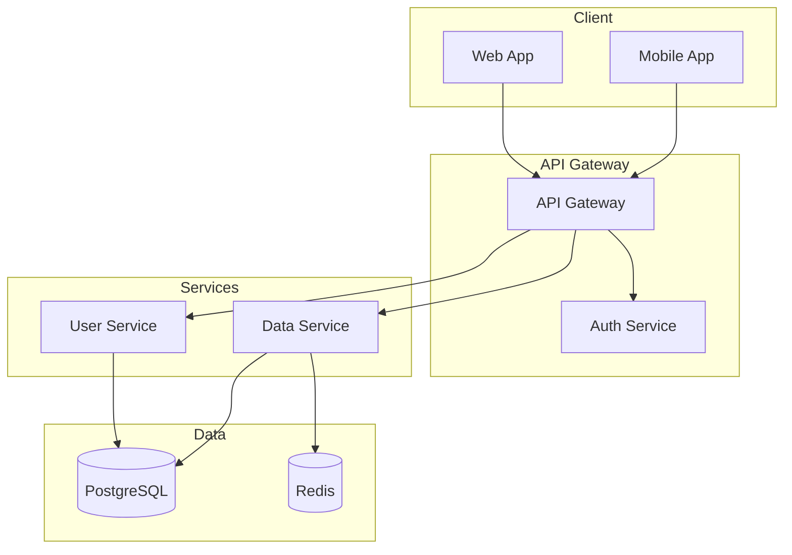

# Generate Architecture Diagram Command

CCAGI SDK Phase 2 コマンド (CMD-004)

要件定義からシステムアーキテクチャ図を自動生成します。

## 使用方法

```bash
/generate-architecture-diagram [path]
```

## パラメータ

- `path` (オプション): 追加のコンテキストファイルパス

## 実行フロー

```mermaid
graph TD
    A[/generate-architecture-diagram] --> B[θ₁ 要件・技術制約読込]
    B --> C[θ₂ コンポーネント抽出]
    C --> D[θ₃ レイヤー構成決定]
    D --> E[θ₄ Mermaid生成]
    E --> F[θ₅ 整合性検証]
    F --> G[${DIAGRAMS}/architecture.md]
```

## 出力先

```
docs/diagrams/architecture.md
```

## 前提条件

```
依存関係: CMD-001 → CMD-004
```

## 実行例

```bash
/generate-architecture-diagram
```

**期待される出力**:

```
🏗️ CCAGI Architecture Diagram Generator (CMD-004)

Phase 2: Design - Architecture
━━━━━━━━━━━━━━━━━━━━━━━━━━━━━━

θ₁ Understanding...
   ✅ 技術制約分析完了
   🔍 アーキテクチャパターン: Layered + Microservices

θ₂ Generating...
   ✅ コンポーネント抽出: 8個
   ✅ 外部連携: 3サービス

θ₃ Allocating...
   ✅ Presentation Layer: Frontend, BFF
   ✅ Business Layer: API, Services
   ✅ Data Layer: Database, Cache

θ₄ Executing...
   📊 全体アーキテクチャ図生成
   📊 レイヤー詳細図生成
   📊 デプロイメント図生成

θ₅ Integrating...
   ✅ コンポーネント整合性: PASS

━━━━━━━━━━━━━━━━━━━━━━━━━━━━━━
✅ Architecture Diagrams Generated

出力: docs/diagrams/architecture.md
実行時間: 25s
```

## 出力形式

### architecture.md

````markdown
# システムアーキテクチャ図

## 全体アーキテクチャ



## コンポーネント詳細

### API Gateway
- 責務: リクエストルーティング、認証検証
- 技術: AWS API Gateway / Kong
````

## 依存関係

**依存元**: CMD-001
**依存先**: CMD-008, CMD-009

## 関連コマンド

- [/generate-sequence-diagram](./generate-sequence-diagram.md) (CMD-003)
- [/generate-dataflow-diagram](./generate-dataflow-diagram.md) (CMD-005)

---

🤖 CCAGI SDK v6.15.0 - Phase 2: Design (CMD-004)
