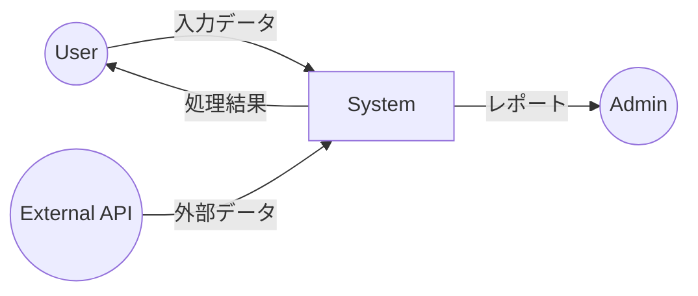
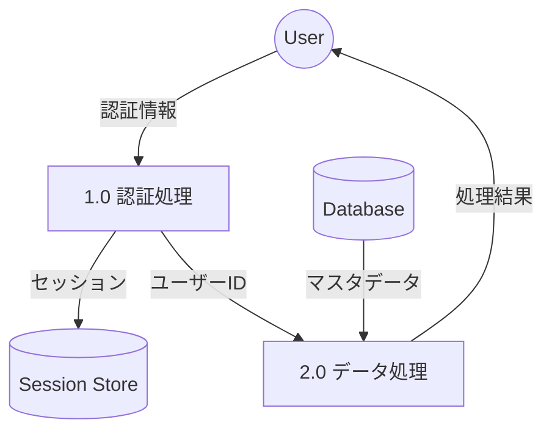

# Generate Dataflow Diagram Command

CCAGI SDK Phase 2 コマンド (CMD-005)

要件定義からデータフロー図（DFD）を自動生成します。

## 使用方法

```bash
/generate-dataflow-diagram [path]
```

## パラメータ

- `path` (オプション): 追加のコンテキストファイルパス

## 実行フロー

```mermaid
graph TD
    A[/generate-dataflow-diagram] --> B[θ₁ 要件・データ構造読込]
    B --> C[θ₂ データフロー抽出]
    C --> D[θ₃ プロセス・ストア特定]
    D --> E[θ₄ DFD生成]
    E --> F[θ₅ 整合性検証]
    F --> G[${DIAGRAMS}/dataflow.md]
```

## 出力先

```
docs/diagrams/dataflow.md
```

## 前提条件

```
依存関係: CMD-001 → CMD-005
```

## 実行例

```bash
/generate-dataflow-diagram
```

**期待される出力**:

```
🔀 CCAGI Dataflow Diagram Generator (CMD-005)

Phase 2: Design - Data Flow
━━━━━━━━━━━━━━━━━━━━━━━━━━━━

θ₁ Understanding...
   ✅ データエンティティ検出: 8個
   🔍 外部インターフェース: 3個

θ₂ Generating...
   ✅ データフロー抽出: 24本
   ✅ 変換プロセス: 12個

θ₃ Allocating...
   ✅ Level 0 (コンテキスト図)
   ✅ Level 1 (主要プロセス)
   ✅ Level 2 (詳細プロセス)

θ₄ Executing...
   📊 DFD Level 0 生成
   📊 DFD Level 1 生成
   📊 DFD Level 2 生成

θ₅ Integrating...
   ✅ データ整合性: PASS
   ✅ フロー完全性: PASS

━━━━━━━━━━━━━━━━━━━━━━━━━━━━━━
✅ Dataflow Diagrams Generated

出力: docs/diagrams/dataflow.md
レベル数: 3
実行時間: 28s
```

## 出力形式

### dataflow.md

````markdown
# データフロー図 (DFD)

## Level 0: コンテキスト図



## Level 1: 主要プロセス



## データ辞書

| データ項目 | 型 | 説明 |
|-----------|-----|------|
| ユーザーID | UUID | 一意識別子 |
| 認証情報 | Object | email, password |
````

## 依存関係

**依存元**: CMD-001
**依存先**: CMD-006, CMD-010

## 関連コマンド

- [/generate-sequence-diagram](./generate-sequence-diagram.md) (CMD-003)
- [/generate-architecture-diagram](./generate-architecture-diagram.md) (CMD-004)
- [/generate-unit-test-design](./generate-unit-test-design.md) (CMD-006)

---

🤖 CCAGI SDK v6.15.0 - Phase 2: Design (CMD-005)
