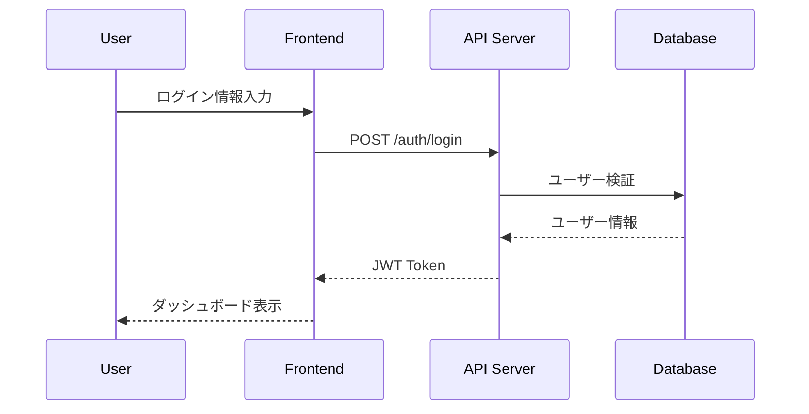

# Generate Sequence Diagram Command

CCAGI SDK Phase 2 コマンド (CMD-003)

## ⚠️ SWMLワークフロー指示（必須）

このコマンドを実行する際、**必ず**以下のワークフローに従ってください：

```
メモリ使用量は、最大92%
そのために効率よく並列処理
必ず、必ず、必ず、miyabi のワークフローシステムに従って、タスク分解して計画、プランニングを行ってください。
このマスターIssue、このマスタータスクをタスク分解、分解バラバラにしちゃって、アサインできる状態でサブIssuesに分割してください。
分割したら、目的を達成するまで、作業をひたすら続けてください

完了したIssueはクローズしてください
```

**SWMLフロー**: θ₁ Understand → θ₂ Generate → θ₃ Allocate → θ₄ Execute → θ₅ Integrate → θ₆ Learn

---

要件定義からシーケンス図を自動生成します。

## 使用方法

```bash
/generate-sequence-diagram [path]
```

## パラメータ

- `path` (オプション): 追加のコンテキストファイルパス
  - 既存のソースコード
  - API仕様書
  - 設計ドキュメント

## 実行フロー

```mermaid
graph TD
    A[/generate-sequence-diagram] --> B[θ₁ 要件読み込み]
    B --> C[θ₂ インタラクション抽出]
    C --> D[θ₃ アクター・システム特定]
    D --> E[θ₄ Mermaid生成]
    E --> F[θ₅ 整合性検証]
    F --> G[θ₆ 出力・学習]
    G --> H[${DIAGRAMS}/sequence.md]
```

## 出力先

```
docs/diagrams/sequence.md
```

## 前提条件

```
依存関係: CMD-001 → CMD-003
```

## 実行例

```bash
/generate-sequence-diagram
```

**期待される出力**:

```
📊 CCAGI Sequence Diagram Generator (CMD-003)

Phase 2: Design - Sequence Diagrams
━━━━━━━━━━━━━━━━━━━━━━━━━━━━━━━━━━━

θ₁ Understanding...
   ✅ 要件ファイル読み込み: 5ファイル
   🔍 ユースケース検出: 12件

θ₂ Generating...
   ✅ インタラクション抽出: 45件
   🔄 シーケンスフロー構築中...

θ₃ Allocating...
   ✅ アクター: User, Admin, System
   ✅ サービス: Auth, API, Database

θ₄ Executing...
   📊 SD-001: ユーザー認証フロー
   📊 SD-002: データ取得フロー
   📊 SD-003: 更新処理フロー
   ...

θ₅ Integrating...
   ✅ 要件カバレッジ: 100%
   ✅ 整合性: PASS

θ₆ Learning...
   📊 パターン学習完了

━━━━━━━━━━━━━━━━━━━━━━━━━━━━━━
✅ Sequence Diagrams Generated

出力: docs/diagrams/sequence.md
図数: 12
実行時間: 30s

次のステップ:
  /generate-architecture-diagram  # アーキテクチャ図
  /generate-dataflow-diagram      # データフロー図
```

## 出力形式

### sequence.md

````markdown
# シーケンス図

## SD-001: ユーザー認証フロー



### 関連要件
- FR-001: ユーザー認証
- FR-002: セッション管理
````

## 依存関係

**依存元**: CMD-001
**依存先**: CMD-007, CMD-008, CMD-009

## 関連コマンド

- [/generate-architecture-diagram](./generate-architecture-diagram.md) (CMD-004)
- [/generate-dataflow-diagram](./generate-dataflow-diagram.md) (CMD-005)

---

## 実行時の指示（Claude向け）

このコマンドを実行する際、必ず以下のGitHub Issue連携を行ってください：

### Step 1: SSOT Issue取得

`.ccagi.yml` からSSOT Issue番号を取得：

```bash
SSOT_ISSUE=$(grep 'issue_number' .ccagi.yml 2>/dev/null | awk '{print $2}')
PHASE2_ISSUE=$(grep 'phase2' .ccagi.yml 2>/dev/null | awk '{print $2}')
```

### Step 2: Phase 2 作業用Issue作成（存在しない場合）

Phase 2 Issueが存在しない場合、**必ず**作成：

```bash
if [ -z "$PHASE2_ISSUE" ] && [ -n "$SSOT_ISSUE" ]; then
  PHASE2_ISSUE=$(gh issue create \
    --title "🎨 Phase 2: 設計 - #${SSOT_ISSUE}" \
    --body "$(cat <<EOF
親Issue: #${SSOT_ISSUE}

## 🎨 Phase 2: Design

設計フェーズの作業を管理します。

## タスク

- [ ] シーケンス図生成 (\`/generate-sequence-diagram\`)
- [ ] アーキテクチャ図生成 (\`/generate-architecture-diagram\`)
- [ ] データフロー図生成 (\`/generate-dataflow-diagram\`)

## 生成ドキュメント

- [sequence.md](./docs/diagrams/sequence.md)
- [architecture.md](./docs/diagrams/architecture.md)
- [dataflow.md](./docs/diagrams/dataflow.md)

## 依存関係

- **依存元**: Phase 1 (Requirements)
- **依存先**: Phase 3 (Planning)

---
🤖 Generated by CCAGI SDK
EOF
)" \
    --label "phase:design,🤖 automated" | grep -oE '[0-9]+$')

  echo "Phase 2 Issue #${PHASE2_ISSUE} を作成しました"

  # .ccagi.yml に記録
  echo "  phase2: ${PHASE2_ISSUE}" >> .ccagi.yml

  # SSOT Issueにコメント
  gh issue comment ${SSOT_ISSUE} --body "## 🎨 Phase 2: Design 開始

Phase 2 Issue: #${PHASE2_ISSUE}

開始時刻: $(date '+%Y-%m-%d %H:%M:%S')
"
fi
```

### Step 3: シーケンス図生成後のIssue更新

生成完了後、**必ず**Phase 2 Issueを更新：

```bash
if [ -n "$PHASE2_ISSUE" ]; then
  gh issue comment ${PHASE2_ISSUE} --body "## ✅ シーケンス図生成完了

完了時刻: $(date '+%Y-%m-%d %H:%M:%S')

### 生成ファイル
- [sequence.md](./docs/diagrams/sequence.md)

### サマリー
- 図数: XX
- カバレッジ: 100%
"
fi
```

### Step 4: 全Phase 2コマンド完了時

全てのPhase 2コマンド（シーケンス図、アーキテクチャ図、データフロー図）が完了したら：

```bash
# Phase 2 Issueをクローズ
gh issue close ${PHASE2_ISSUE} --comment "✅ Phase 2 完了 - 全設計図の生成が完了しました"

# SSOT Issueを更新
gh issue comment ${SSOT_ISSUE} --body "## ✅ Phase 2: Design 完了

完了時刻: $(date '+%Y-%m-%d %H:%M:%S')

### 生成ドキュメント
- [sequence.md](./docs/diagrams/sequence.md)
- [architecture.md](./docs/diagrams/architecture.md)
- [dataflow.md](./docs/diagrams/dataflow.md)

### 次のステップ
\`/plan-project\` を実行してPhase 3を開始
"
```

### Step 5: 完了報告

ユーザーに以下を報告：
- 生成されたシーケンス図一覧
- **Phase 2 Issue URL**
- **SSOT Issue URL**
- 次のステップ

---

🤖 CCAGI SDK v6.21.5 - Phase 2: Design (CMD-003)
