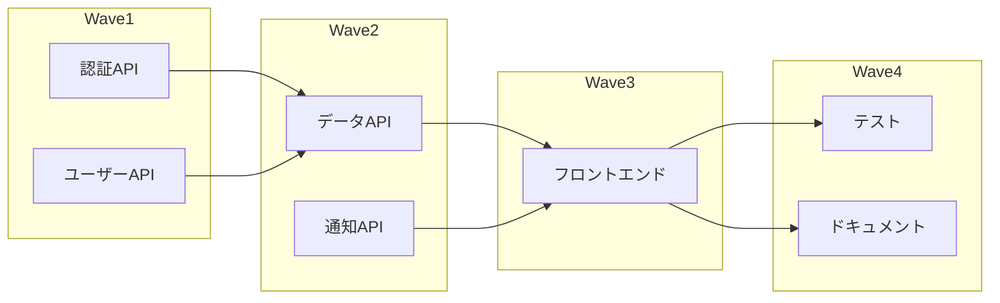

# Optimize Resources Command

CCAGI SDK Phase 3 コマンド (CMD-011)

プロジェクト計画に基づいてAgentとリソースの配置を最適化します。

## 使用方法

```bash
/optimize-resources [path]
```

## パラメータ

- `path` (オプション): 追加の制約ファイルパス

## 実行フロー

```mermaid
graph TD
    A[/optimize-resources] --> B[θ₁ プロジェクト計画読込]
    B --> C[θ₂ タスク特性分析]
    C --> D[θ₃ Agent能力マッチング]
    D --> E[θ₄ 最適割当計算]
    E --> F[θ₅ 並列実行計画]
    F --> G[agent-optimization status]
```

## 出力

```
status: agent-optimization
```

最適化結果はステータスとして出力され、後続のコマンドで参照されます。

## 前提条件

```
依存関係: CMD-010 → CMD-011
```

## 実行例

```bash
/optimize-resources
```

**期待される出力**:

```
⚡ CCAGI Resource Optimizer (CMD-011)

Phase 3: Planning - Resource Optimization
━━━━━━━━━━━━━━━━━━━━━━━━━━━━━━━━━━━━━━

θ₁ Understanding...
   ✅ プロジェクト計画読込
   📊 タスク数: 48
   📊 クリティカルパス: 56h

θ₂ Generating...
   ✅ タスク特性分析完了
   🔄 Agent能力マッピング中...

θ₃ Allocating...
   ✅ CoordinatorAgent: 1インスタンス
   ✅ CodeGenAgent: 3インスタンス (並列)
   ✅ ReviewAgent: 2インスタンス
   ✅ TestAgent: 2インスタンス

θ₄ Executing...
   📊 最適割当計算
   📊 DAG構築
   📊 並列実行グラフ生成

θ₅ Integrating...
   ✅ 予測実行時間: 32h (44%短縮)
   ✅ Agent利用効率: 87%
   ✅ ボトルネック: なし

━━━━━━━━━━━━━━━━━━━━━━━━━━━━━━━━━━
✅ Resource Optimization Complete

状態: agent-optimization
元見積: 56h → 最適化後: 32h
効率改善: 44%

次のステップ:
  /implement-app  # 実装開始
```

## 最適化戦略

### Agent割当マトリクス

```
┌─────────────────────────────────────────────────┐
│             Agent Allocation Matrix              │
├────────────────┬─────────────────────────────────┤
│ Task Type      │ Assigned Agent(s)               │
├────────────────┼─────────────────────────────────┤
│ Code Generation│ CodeGenAgent (x3 parallel)      │
│ Code Review    │ ReviewAgent (x2 pipeline)       │
│ Testing        │ TestAgent (x2 parallel)         │
│ Orchestration  │ CoordinatorAgent                │
│ Documentation  │ CodeGenAgent (time-share)       │
│ Deployment     │ DeploymentAgent                 │
└────────────────┴─────────────────────────────────┘
```

### 並列実行DAG



## 最適化アルゴリズム

```yaml
algorithm:
  name: Adaptive Resource Scheduling
  factors:
    - task_complexity: weight=0.3
    - agent_capability: weight=0.3
    - dependency_graph: weight=0.2
    - historical_performance: weight=0.2
  constraints:
    - max_parallel_agents: 8
    - memory_limit: 16GB
    - api_rate_limit: 1000/min
```

## 出力ファイル

最適化結果は以下のファイルに保存されます:

```
.ccagi/
├── optimization/
│   ├── agent-allocation.json   # Agent割当
│   ├── execution-dag.json      # 実行DAG
│   └── metrics.json            # 予測メトリクス
```

## 依存関係

**依存元**: CMD-010 (plan-project)
**依存先**: CMD-012 (implement-app)

## SWML Workflow統合

```yaml
instructions:
  - SWML_WORKFLOW  # θ₁-θ₆処理フロー
```

## 関連コマンド

- [/plan-project](./plan-project.md) (CMD-010)
- [/implement-app](./implement-app.md) (CMD-012)

---

🤖 CCAGI SDK v6.15.0 - Phase 3: Planning (CMD-011)
