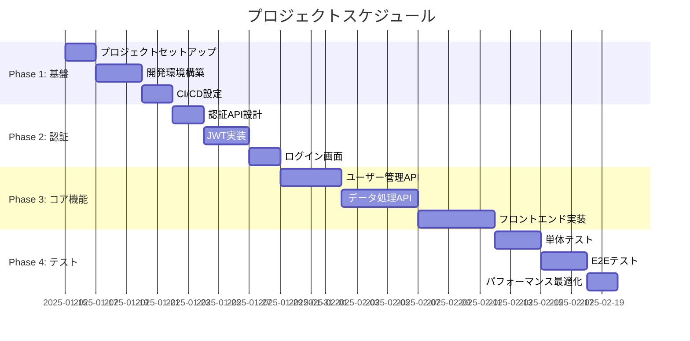

# Plan Project Command

CCAGI SDK Phase 3 コマンド (CMD-010)

## ⚠️ SWMLワークフロー指示（必須）

このコマンドを実行する際、**必ず**以下のワークフローに従ってください：

```
メモリ使用量は、最大92%
そのために効率よく並列処理
必ず、必ず、必ず、miyabi のワークフローシステムに従って、タスク分解して計画、プランニングを行ってください。
このマスターIssue、このマスタータスクをタスク分解、分解バラバラにしちゃって、アサインできる状態でサブIssuesに分割してください。
分割したら、目的を達成するまで、作業をひたすら続けてください

完了したIssueはクローズしてください
```

**SWMLフロー**: θ₁ Understand → θ₂ Generate → θ₃ Allocate → θ₄ Execute → θ₅ Integrate → θ₆ Learn

---

要件定義と設計図からプロジェクト計画・スケジュールを自動生成します。

## 使用方法

```bash
/plan-project
```

## 実行フロー

```mermaid
graph TD
    A[/plan-project] --> B[θ₁ 要件・設計図読込]
    B --> C[θ₂ タスク分解]
    C --> D[θ₃ 依存関係分析]
    D --> E[θ₄ スケジュール生成]
    E --> F[θ₅ クリティカルパス特定]
    F --> G[${DOCS_ROOT}/project/schedule.md]
```

## 出力先

```
docs/project/schedule.md
```

## 前提条件

```
依存関係: CMD-001 + CMD-003 + CMD-004 + CMD-005 → CMD-010
```

## 実行例

```bash
/plan-project
```

**期待される出力**:

```
📋 CCAGI Project Planner (CMD-010)

Phase 3: Planning - Project Schedule
━━━━━━━━━━━━━━━━━━━━━━━━━━━━━━━━━━

θ₁ Understanding...
   ✅ 要件ファイル読込: 5ファイル
   ✅ シーケンス図読込
   ✅ アーキテクチャ図読込
   ✅ データフロー図読込

θ₂ Generating...
   ✅ タスク抽出: 48タスク
   🔄 WBS構築中...

θ₃ Allocating...
   ✅ Phase 1: 基盤構築 (8タスク)
   ✅ Phase 2: 認証機能 (12タスク)
   ✅ Phase 3: コア機能 (18タスク)
   ✅ Phase 4: テスト・最適化 (10タスク)

θ₄ Executing...
   📊 ガントチャート生成
   📊 WBS生成
   📊 マイルストーン設定

θ₅ Integrating...
   ✅ クリティカルパス特定
   ✅ リスク分析完了
   📊 総見積: 160h

━━━━━━━━━━━━━━━━━━━━━━━━━━━━━━━━━━
✅ Project Plan Generated

出力: docs/project/schedule.md
タスク数: 48
マイルストーン: 4
クリティカルパス: 認証→コアAPI→テスト

次のステップ:
  /optimize-resources  # リソース最適化
```

## 出力形式

### schedule.md

````markdown
# プロジェクト計画書

## 概要

| 項目 | 値 |
|------|-----|
| プロジェクト名 | [Project Name] |
| 総タスク数 | 48 |
| 総見積時間 | 160h |
| マイルストーン | 4 |
| クリティカルパス長 | 96h |

---

## ガントチャート



## WBS (Work Breakdown Structure)

### 1.0 基盤構築
- 1.1 プロジェクトセットアップ (4h)
- 1.2 開発環境構築 (8h)
- 1.3 CI/CD設定 (6h)

### 2.0 認証機能
- 2.1 認証API設計 (4h)
- 2.2 JWT実装 (8h)
- 2.3 ログイン画面 (6h)
- 2.4 トークンリフレッシュ (4h)

### 3.0 コア機能
...

## クリティカルパス

```
開始 → 環境構築 → JWT実装 → ユーザーAPI → データAPI → E2Eテスト → 完了
      [8h]        [8h]       [12h]        [16h]        [12h]
                          総所要時間: 56h
```

## マイルストーン

| ID | マイルストーン | 完了条件 | 予定日 |
|----|---------------|----------|--------|
| M1 | 基盤完成 | CI/CDパイプライン稼働 | Week 1 |
| M2 | 認証完成 | ログイン機能動作 | Week 2 |
| M3 | コア完成 | 全API稼働 | Week 4 |
| M4 | リリース | E2Eテスト全パス | Week 5 |

## リスク分析

| リスク | 影響度 | 発生確率 | 対策 |
|--------|--------|----------|------|
| 外部API連携遅延 | 高 | 中 | モック使用 |
| 要件変更 | 中 | 高 | バッファ確保 |
````

## 依存関係

**依存元**: CMD-001, CMD-003, CMD-004, CMD-005
**依存先**: CMD-011 (optimize-resources)

## SWML Workflow統合

```yaml
instructions:
  - SWML_WORKFLOW  # θ₁-θ₆処理フロー
```

## 関連コマンド

- [/optimize-resources](./optimize-resources.md) (CMD-011)
- [/implement-app](./implement-app.md) (CMD-012)

---

## 実行時の指示（Claude向け）

このコマンドを実行する際、必ず以下のGitHub Issue連携を行ってください：

### Step 1: SSOT Issue取得

`.ccagi.yml` からSSOT Issue番号を取得：

```bash
SSOT_ISSUE=$(grep 'issue_number' .ccagi.yml 2>/dev/null | awk '{print $2}')
PHASE3_ISSUE=$(grep 'phase3' .ccagi.yml 2>/dev/null | awk '{print $2}')
```

### Step 2: Phase 3 作業用Issue作成

**必ず**Phase 3の作業用Issueを作成：

```bash
if [ -z "$PHASE3_ISSUE" ] && [ -n "$SSOT_ISSUE" ]; then
  PHASE3_ISSUE=$(gh issue create \
    --title "📋 Phase 3: 計画 - #${SSOT_ISSUE}" \
    --body "$(cat <<EOF
親Issue: #${SSOT_ISSUE}

## 📋 Phase 3: Planning

プロジェクト計画フェーズの作業を管理します。

## タスク

- [ ] 要件・設計図分析
- [ ] タスク分解（WBS）
- [ ] 依存関係分析
- [ ] スケジュール生成
- [ ] クリティカルパス特定
- [ ] リスク分析

## 生成ドキュメント

- [schedule.md](./docs/project/schedule.md)

## 依存関係

- **依存元**: Phase 2 (Design)
- **依存先**: Phase 4 (Implementation)

---
🤖 Generated by CCAGI SDK
EOF
)" \
    --label "phase:planning,🤖 automated" | grep -oE '[0-9]+$')

  echo "Phase 3 Issue #${PHASE3_ISSUE} を作成しました"

  # .ccagi.yml に記録
  echo "  phase3: ${PHASE3_ISSUE}" >> .ccagi.yml

  # SSOT Issueにコメント
  gh issue comment ${SSOT_ISSUE} --body "## 📋 Phase 3: Planning 開始

Phase 3 Issue: #${PHASE3_ISSUE}

開始時刻: $(date '+%Y-%m-%d %H:%M:%S')
"
fi
```

### Step 3: Phase 4 サブIssue作成（タスク分解）

タスク分解結果に基づき、**必ず**Phase 4のサブIssuesを作成：

```bash
# Phase 4 メインIssue作成
PHASE4_ISSUE=$(gh issue create \
  --title "🚀 Phase 4: 実装 - #${SSOT_ISSUE}" \
  --body "$(cat <<EOF
親Issue: #${SSOT_ISSUE}

## 🚀 Phase 4: Implementation

実装フェーズの作業を管理します。

## サブタスク

- [ ] フロントエンド実装
- [ ] バックエンド実装
- [ ] DB設計・実装

## 依存関係

- **依存元**: Phase 3 (Planning)
- **依存先**: Phase 5 (Testing)

---
🤖 Generated by CCAGI SDK
EOF
)" \
  --label "phase:implementation,🤖 automated" | grep -oE '[0-9]+$')

echo "  phase4: ${PHASE4_ISSUE}" >> .ccagi.yml

# Phase 4 サブIssue作成
gh issue create \
  --title "Phase 4-1: フロントエンド実装 - #${PHASE4_ISSUE}" \
  --body "$(cat <<EOF
親Issue: #${PHASE4_ISSUE}
SSOT: #${SSOT_ISSUE}

## タスク
- [ ] コンポーネント設計
- [ ] 画面実装
- [ ] スタイリング
- [ ] API連携

## 依存関係
- 依存元: Phase 3完了
- 依存先: Phase 4-3 (統合)

## 見積時間
16h
EOF
)" \
  --label "phase:implementation,🤖 automated"

gh issue create \
  --title "Phase 4-2: バックエンド実装 - #${PHASE4_ISSUE}" \
  --body "$(cat <<EOF
親Issue: #${PHASE4_ISSUE}
SSOT: #${SSOT_ISSUE}

## タスク
- [ ] API設計
- [ ] エンドポイント実装
- [ ] DB連携
- [ ] 認証統合

## 依存関係
- 依存元: Phase 3完了
- 依存先: Phase 4-3 (統合)

## 見積時間
20h
EOF
)" \
  --label "phase:implementation,🤖 automated"

gh issue create \
  --title "Phase 4-3: DB設計・実装 - #${PHASE4_ISSUE}" \
  --body "$(cat <<EOF
親Issue: #${PHASE4_ISSUE}
SSOT: #${SSOT_ISSUE}

## タスク
- [ ] スキーマ設計
- [ ] マイグレーション作成
- [ ] シード作成

## 依存関係
- 依存元: Phase 3完了
- 依存先: Phase 4-2 (バックエンド)

## 見積時間
8h
EOF
)" \
  --label "phase:implementation,🤖 automated"
```

### Step 4: Phase 3完了・SSOT Issue更新

```bash
# Phase 3 Issueをクローズ
gh issue close ${PHASE3_ISSUE} --comment "✅ Phase 3 完了 - プロジェクト計画が完了しました"

# SSOT Issueにコメント追加
gh issue comment ${SSOT_ISSUE} --body "## ✅ Phase 3: Planning 完了

完了時刻: $(date '+%Y-%m-%d %H:%M:%S')

### 生成ファイル
- docs/project/schedule.md

### 作成されたIssue
- Phase 3 Issue: #${PHASE3_ISSUE} (完了)
- Phase 4 Issue: #${PHASE4_ISSUE}
  - Phase 4-1: フロントエンド実装
  - Phase 4-2: バックエンド実装
  - Phase 4-3: DB設計・実装

### タスク分解サマリー
- 総タスク数: 48
- マイルストーン: 4
- クリティカルパス: 認証→コアAPI→テスト

### 次のステップ
\`/implement-app\` を実行してPhase 4を開始
"
```

### Step 5: 完了報告

ユーザーに以下を報告：
- 生成されたスケジュール
- **Phase 3 Issue URL**
- **Phase 4 Issue一覧**とURL
- DAG依存関係の説明
- 次のステップ

---

🤖 CCAGI SDK v6.21.5 - Phase 3: Planning (CMD-010)
