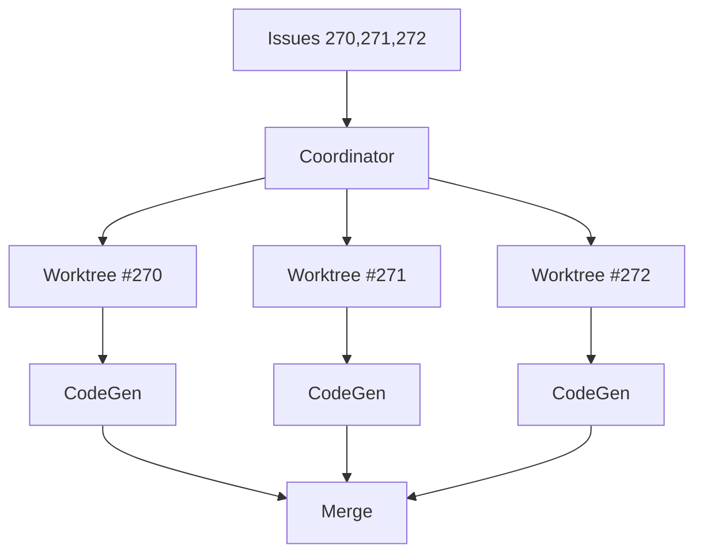

# 🤖 Agent Execution with Worktree

**Version**: 2.0.1 (CCAGI Adapted)
**Last Updated**: 2025-12-04
**Priority**: ⭐⭐⭐⭐⭐ (P0 Level)
**Purpose**: CCAGI Agent実行とWorktree分離による並列処理

---

## 📋 概要

CCAGIの自律型Coding Agentsを、Git Worktree分離により安全な並列実行で処理。
コンフリクトフリーな開発を実現します。

---

## 🎯 P0: 呼び出しトリガー

| トリガー | 例 |
|---------|-----|
| Agent実行 | "run coordinator agent on issue #270" |
| 並列処理 | "process multiple issues in parallel" |
| 特定Agent | "execute codegen agent" |
| Issue処理 | "process issue #270" |
| タスク管理 | "managing concurrent tasks" |

---

## 🔧 P1: Agent分類と実行ルール

### Agent優先順位表

| Agent | 並列可否 | 依存関係 | 用途 |
|-------|---------|---------|------|
| 🔴 CoordinatorAgent | ❌ Sequential | なし | タスク分解・DAG構築・割り当て |
| 🟢 CodeGenAgent | ✅ Parallel | Coordinator | コード生成・実装 |
| 🟢 ReviewAgent | ✅ Parallel | CodeGen | 品質レビュー・スコアリング（80点以上） |
| 🟢 SecurityAgent | ✅ Parallel | CodeGen | セキュリティチェック（80点以上） |
| 🟢 TestAgent | ✅ Parallel | CodeGen | テストコード生成・実行 |
| 🟡 PRAgent | ⚠️ Conditional | CodeGen | Draft PR作成・マージ |
| 🟢 IssueAgent | ✅ Parallel | なし | Issue分析・ラベル推論 |

### 並列実行ルール

```
✅ 安全な並列実行:
- 🟢 CodeGenAgent + 🟢 ReviewAgent (異なるIssue)
- 🟢 CodeGenAgent + 🟢 IssueAgent
- 🟢 IssueAgent + 🟢 IssueAgent (異なるIssue)

❌ 禁止される並列実行:
- 🔴 CoordinatorAgent × 2 (Sequential only)
- 同じAgentで同じIssue (Race condition)

⚠️ 条件付き実行:
- 🟡 DeploymentAgent: ReviewAgent品質チェックpass後
- 🟡 PRAgent: CodeGenAgent実装完了後
```

---

## 🚀 P2: 実行方法別パターン

### Pattern 1: 単一Issue処理

```bash
# CCAGI Agent実行（Node.js経由）
npm run agents:parallel:exec -- --issue 270
```

**フロー**:


```mermaid
graph LR
    A[Issue #270] --> B[Coordinator]
    B --> C[CodeGen]
    C --> D[Review]
    D --> E{Pass?}
    E -->|Yes| F[PR作成]
    E -->|No| C
```

### Pattern 2: 複数Issue並列処理

```bash
# 並列度指定（複数Issue処理）
npm run agents:parallel:exec -- --issues 270,271,272
```

**フロー**:


### Pattern 3: MCP Tool経由Agent実行

```bash
# CCAGI MCPツール経由（Claude Code内で使用可能）
# ccagi__agent_run ツールを使用
# 例: {"agent": "codegen", "issue": 270}
```

---

## ⚡ P3: Worktreeライフサイクル

### Phase 1: Worktree作成

```bash
# 分離されたWorktree作成
git worktree add .worktrees/issue-270 -b issue-270-feature
```

### Phase 2: コンテキスト設定

各Worktreeに自動生成:
```
.worktrees/issue-270/
├── .agent-context.json      # 機械可読コンテキスト
├── EXECUTION_CONTEXT.md     # 人間可読指示書
└── [Agent-specific files]
```

### Phase 3: Agent実行

```bash
cd .worktrees/issue-270
# Claude CodeがEXECUTION_CONTEXT.mdを読み込み
# Agent固有ワークフロー実行
# Conventional Commitsでコミット
```

### Phase 4: マージ＆クリーンアップ

```bash
# ブランチプッシュ
git -C .worktrees/issue-270 push -u origin issue-270-feature

# PR作成またはマージ
gh pr create --title "feat: Issue #270" --draft

# Worktree削除
git worktree remove .worktrees/issue-270
git branch -d issue-270-feature
```

---

## 📊 Agent別最適設定

### CodeGenAgent（つくるん）

| 設定 | 値 | 備考 |
|------|-----|------|
| 並列度 | 3-5 | CPU/メモリ依存 |
| タイムアウト | 30分 | 複雑度により調整 |
| リトライ | 2回 | ビルドエラー時 |

**最適コマンド**:
```bash
# CCAGIプロジェクト固有のビルド・テスト
cd .worktrees/issue-270
npm test
npm run typecheck
npm run lint
```

### ReviewAgent（めだまん）

| 設定 | 値 | 備考 |
|------|-----|------|
| 並列度 | 2-3 | レビュー品質維持 |
| スコア閾値 | 80点 | Pass/Fail判定 |
| 監査項目 | 5項目 | セキュリティ含む |

**品質スコア基準**:
```
90-100点: quality:excellent
80-89点:  quality:good
70-79点:  quality:fair
<70点:    quality:needs-improvement (要修正)
```

---

## 🛡️ エラーハンドリング

### Worktree作成失敗

```bash
# 既存Worktree確認
git worktree list

# 古いWorktree削除
git worktree prune

# 再作成
git worktree add .worktrees/issue-270 -b issue-270-feature
```

### マージコンフリクト

```bash
# Worktree内でコンフリクト解決
cd .worktrees/issue-270
git status
# [コンフリクト解決]
git add .
git commit -m "fix: resolve merge conflicts"
```

### Agent実行失敗

```bash
# コンテキスト確認
cat .worktrees/issue-270/.agent-context.json
cat .worktrees/issue-270/EXECUTION_CONTEXT.md

# 強制再実行
npm run agents:parallel:exec -- --issue 270 --force
```

---

## ✅ 成功基準

| チェック項目 | 基準 |
|-------------|------|
| Worktree作成 | 成功 |
| Agent割り当て | Task type適合 |
| コンテキスト生成 | 2ファイル生成 |
| Claude実行 | ワークフロー完了 |
| コミット | Conventional Commits |
| マージ/PR | 成功 |
| クリーンアップ | Worktree削除完了 |

---

## 🔗 関連ドキュメント

| ドキュメント | 用途 |
|-------------|------|
| `.claude-plugin/agents/*.md` | Agent定義 |
| `.claude/mcp.json` | MCPサーバー設定 |
| `.ccagi.yml` | CCAGI設定 |
| `CLAUDE.md` | プロジェクトルール |

---

## 📝 関連Skills

- **TDD Workflow**: Agent実行前のテスト
- **Issue Analysis**: Agent割り当て前の分析
- **Git Workflow**: Worktreeブランチ管理
